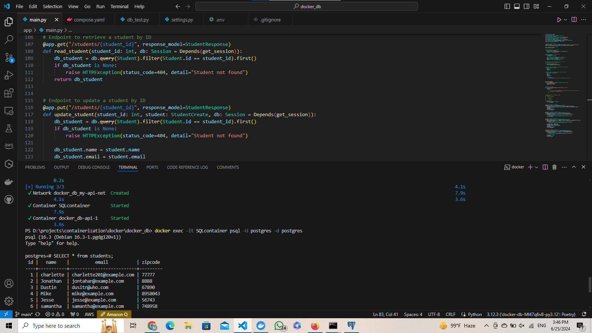

# Containerizing a basic FastAPI Student bio data Management Application integrated with PostgreSQL
This project is an instance of how to integrate an API with Postgres and containerize it inside the Docker

## Technologies Used

- **FastAPI**: A modern, fast (high-performance) web framework for building APIs with Python 3.6+.
- **SQLAlchemy**: SQL toolkit and Object-Relational Mapping (ORM) library for Python.
- **PostgreSQL**: A powerful, open source object-relational database system.
- **Pydantic**: Data validation and settings management using Python type annotations.
- **DockerCompose**: To containerize our API 

## Prerequisites

- Python 3.12
- PostgreSQL database

## Key Points
* in the follwing project a FastAPI app has been created that performs basic CRUD operations and takes the data of the students which includes their names, emails and ZIP codes.
* Docker compose creates two individual images for two individual containers, in the first container database operations gets performed and in the second container it's your FastAPI app as usual.
**yet in this case the second container depends on the first container**

# Compose.yaml file
**Docker Compose Configuration**
This project uses Docker Compose to orchestrate a multi-container Docker application. The docker-compose.yml file defines two services: api and postgres_db. Here's a breakdown of the configuration:

Services
api:

* build: Specifies the build context and the Dockerfile to use for building the image.
*   context: ./ indicates the current directory.
*   dockerfile: "Dockerfile" specifies the Dockerfile name.
* depends_on: Ensures that the postgres_db service is started before the api service.
  * ports: Maps port 8000 on the host to port 8000 in the container, making the API accessible at http://localhost:8000.
  * networks: Connects the api service to the my-api-net network.
* postgres_db:

*   image: Uses the latest postgres image from Docker Hub.
*   restart: Always restarts the container if it stops.
*   container_name: Names the container SQLcontainer.
*   environment: Sets environment variables for PostgreSQL:
*     POSTGRES_USER: Username for the PostgreSQL database.
*     POSTGRES_PASSWORD: Password for the PostgreSQL database (replace with your actual password).
*     POSTGRES_DB: Database name to create.
* ports: Maps port 5432 on the host to port 5432 in the container, making the database accessible at localhost:5432.
* volumes: Mounts a volume named postgres_db to persist database data at /var/lib/postgresql/data inside the container.
*  networks: Connects the postgres_db service to the my-api-net network.
* Volumes
*   postgres_db:
*     driver: local: Uses the local driver to create a named volume for persisting PostgreSQL data.
* Networks
*   my-api-net:
*     driver: bridge: Uses the bridge driver to create an isolated network for the services to communicate.

# main.py file
**fastAPI app creation performing CRUD operations, declaring of sqlalchemy and pydantic models**

# settings.py file
**connects the API with PostgresQL**

## Usage
To start the application, run the following command in the directory containing the docker-compose.yml file:
```docker compose up -d
```

### To see the logs of a container created by docker compose 
```
docker compose logs <service name>
```
#To access the table 
### To enter into the postgres container and acess the table
```
docker exec -it SQLcontainer psql -U postgres -d postgres
```
### To access the table
```
SELECT * from students;
```
## As can  be seen in the picture



the table can be accessed by running an SQL command on PgAdmin
